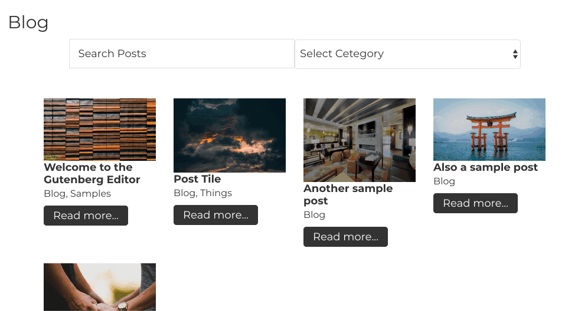

# React App Shortcode Starter

Description: This is a simple React app that queries posts, and is meant as a starter for interactivity.
The app itself comes with text and category real time sorting.

Extend at your leasure 🤓. Modify and extend the actual shortcode in `shortcodes/post-query-results.php`

This is a very basic webpack config, just to compile JSX and runs babel for transpiling.

## Install, run, compile.

1. `cd` into the `react-app` directory.
2. Run `npm install`.
3. This gets everything installed, run `npm run build` to compile.

## Things to improve

- Add in CSS bundling so styles can be added to `App.css`
- Watch and compile to the `dist` folder on save
- maybe create an `npx create-react-shortcode` boilerplate... Although just found this: https://github.com/gopangolin/wp-reactivate so maybe I can use that going forward... `¯\_(ツ)\*/¯`

### Resources Used:

- https://www.valentinog.com/blog/babel/ (follow this pretty closely).
- https://javascriptforwp.com/enqueue-react-in-wordpress/
